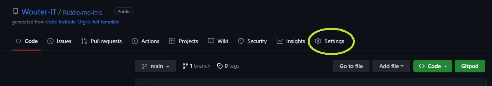
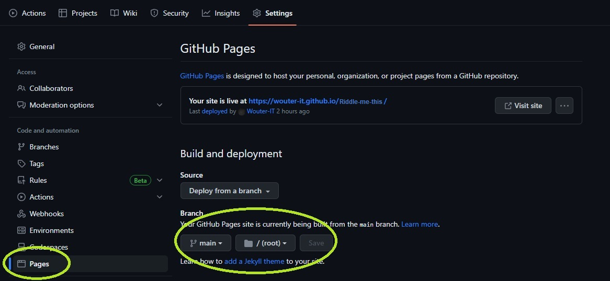
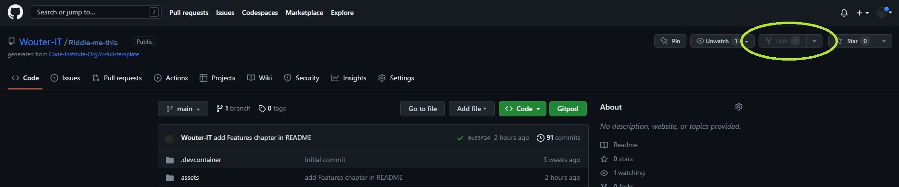
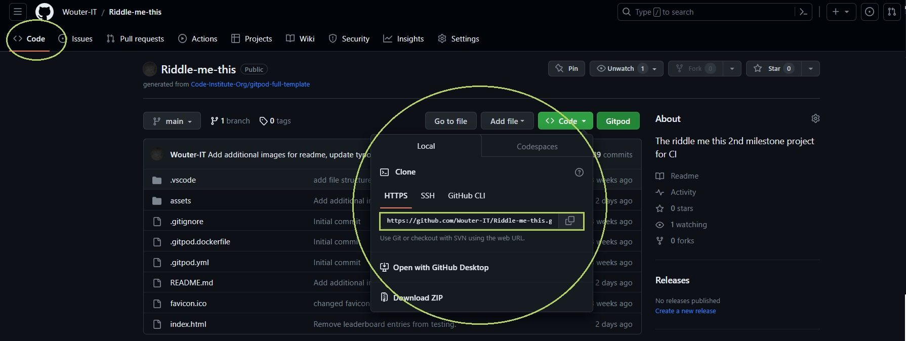

---------------------------------------------------------------------------------------------------------------------
# Riddle me this! Quiz

The Riddle me this quiz is a game challenging the player to answer 5 riddles in a row (as fast as possible) and with as little mistakes as possible. Upon starting the game 5 riddles are selected from a pool of 50 riddles at random, garuanteeing a unique experience every time a player starts a run. Everytime somebody finished a run, either by giving up or completing 5 riddles, the score is pushed to a leaderboard. Only the top 10 players are displayed on the leaderboards however, so the pressure is on to perform! The website is geared towards people that enjoy a challenge, focussing on the ability to solve riddles under time pressure. Wrong answers are registered as well, so brute forcing a solution is not an option!

Do you believe you got what it takes to conquer the leaderboard?
Let's find out!

* the website of* <a href="https://wouter-it.github.io/Riddle-me-this/" target="_blank">*Riddle Me This!*</a>.

# Contents
- [User Experience UX](<#user-experience-ux>)
  - [Wireframes](<#wireframes>)
  - [Site Structure](<#site-structure>)
  - [Design & Color Scheme](<#design--color-scheme>)
    - [Typography](<#typography>)
    - [Color Palatte](<#color-palette>)
- [Features](<#features>)
  - [Current Features](<#current-features>)  
    - [Logo & Navigation](<#logo--navigation>)
    - [Hero](<#hero>)
    - [About](<#about>)
    - [Sign-up form](<#sign-up-form>)
    - [Footer](<#footer>)
    - [Confirmation message](<#confirmation-message>)
    - [Tutorial](<#tutorial>)
    - [Tutorial Video](<#tutorial-video>)
    - [Maps](<#maps>)
  - [Future Features](<#future-features>)
- [Technologies & Tools used](<#technologies--tools-used>)
- [Testing](<#testing>)
- [Deployment](<#deployment>)
  - [How to deploy the project yourself](<#how-to-deploy-the-project-yourself>)
  - [Copy repo to GitHub](<#to-copy-the-repository-in-github>)
  - [Create local clone](<#to-create-a-local-clone-of-this-project>)
- [Comments](<#comments>)
- [Credits](<#credits>)
  - [Content](<#content>)
  - [Media](<#media>)
- [Acknowledgements](<#acknowledgements>)
- [Sign-off](<#sign-off>)

# User Experience UX

## Wireframes

The Wireframes for Riddle me this were made using [Figma](https://www.figma.com/) as opposed to Balsamiq due to familiarity and experience that has been build up with Figma over the past months. There are wireframes for three separate devices; Full-Screen, Tablet and Mobile.
The final design of the website varies slightly from the Figma wireframes in some regards as during the process it was discovered the design could be altered to reduce complexitry.

[Back to top](<#contents>)

## Site Structure

Riddle me this has 1 page with 2 distinct different "screens". The page alters between these screens as the user plays the game and completes, or gives up on runs. The first screen displays a greeting and instruction. It introduces the user to the game and attempts to motivate the user to become a player. This happens when the user fills in a username and presses "Enter" or the "Start" button. On the right-hand-side there is a leaderboard dislaying the scores of players who have come before, which can include runs they have completed themselves in the past ass wel. Upon registering a username the introduction/greetings text and the username input field are hidden from view and the game screen, the second screen of the two, is revealed. This screen displays an image, the riddle text and a hint as to what type of answer we are looking for, for each of the riddles. It alsp inclused a button for answering, skipping and forfeitting the riddle. On the left-hand-side the user can see their current username, score and the amount of wrong answers they have given. 

Upon answering a riddle correctly the answer button is disabled and the "next riddle" button pops up that allows the user to refresh the page and start up the next riddle. Upon completing the 5th riddle the user is brought back to the greeting/introduction screen.  

INCLUDE SCREENSHOT OF THE TWO SCREENS SIDE BY SIDE

[Back to top](<#contents>)

## Design & Color Scheme

### Typography
The typography that was chosen for this project was INSERT CORRECT FONTS<a href="https://fonts.google.com/specimen/Bebas+Neue" target="_blank">Bebas Neue</a> for the headers and <a href="https://fonts.google.com/specimen/Montserrat" target="_blank">Montserrat</a> with a fall-back on sans-serif as body text. Bebas Neue was chosen because it already was the main font of the FakeFairytale brand and it suits the role as header well. It is described ad bold and draws in the eyes to the headers to help guide a visitor through the page. Montserrat was chose as body and navigation text based on the recommendation from <a href="https://typ.io/fonts/bebas_neue#:~:text=Bebas%20Neue%20is%20a%20sans,Calluna%2C%20Avenir%20and%20Playfair%20Display." target="_blank">Typ.io</a> as a suitable match. It also has a clean look that's easy to read and thus suited for explanatory texts.

ABOVE STILL REQUIRES WORK

[Back to top](<#contents>)

### Color Palette

The color scheme for the website can be described as "striking" and originates from the desire to make the page memorable (both visualy as well as a fun game experience), playful, yet also functional. The colours picked aren't too bright to remain easy on the eyes and not drawing attention away from the game. The white colour was chosen to break up the color further and to ensure the text is easily readable against the background. Overall the color scheme serves its purpose without sacrificing anything on readability and accessiblity.

[Back to top](<#contents>)

# Features

## Current Features

### Logo & Navigation
- Located at the very top of every page is a fully responsive navigation menu that allows for easy navigation across the site. 
- The FakeFairytale gnome logo is also equipped with a link that returns the user to the home page, as is common on many websites. 
- The logo image disappears on smaller devices as to not take up too much space when limited is available.

[Back to top](<#contents>)

### Hero
- Located just below the navigation is an image and welcome message. The image helps set the tone for the page and is one of the most popular maps made by FakeFairytale. It is blurred out so as to no distract from the message.
- The welcome message immediately states the value the website provides. It is aimed at making you a better map-maker and helps the visitor understand the intent and purpose of the website.

[Back to top](<#contents>)

### About
- A two collumn about section introduces the visitor to the FakeFairytale brand.
- The left-hand text column states the core problems the visitor is experiencing in order captivate them and capture their attention. It then proceeds to introduce the brand to those unfamiliar.
- Two quick navigation buttons help guide the visitor to their destination. They are designed to specifically help the visitor that already knows what they are visiting the page for.
- The right-hand-side video introduces those unfamiliar to the FakeFairytale YouTube Channel with one of it's most popular videos. It also provide knowledge for those who may already know/have Dungeondraft but aren't proficient with it yet.

[Back to top](<#contents>)

### Sign-up form
- A sign-up form lets the visitor register for a mail list that will provide updates on what is happening with the FakeFairytale Brand. It is designed for those who are hooked by the content so far and would like to learn more over the coming period.
- Currently, there is no actual mail list, nor is the form hooked up to any sort of registration system.

[Back to top](<#contents>)

### Footer
- The site footer is always located at the bottom of the page and contains both the social media links & an e-mail address visitors can contact.
- The Social Media links are enhanced with icons and open in separate tabs when clicked. They're there for those who do not wish to sign up for a newsletter or are looking to do so through a different medium.
- Email is added to allow people to contact FakeFairytale directly.

[Back to top](<#contents>)

### Confirmation message
- The confirmation page provides a message to let the visitor know their action of filling in the form has been successful. It also helps them understand they can now navigate to another page if so desired.

[Back to top](<#contents>)

### Tutorial
- An easy-to-follow step-by-step guide to downloading DD. Fully responsive to align below each other when viewing on smaller devices.
- Designed to help the visitor find their way through the installation process of DD, which can be a bit confusing at times.
- The final step in the process helps guide the visitor to the video below.

[Back to top](<#contents>)

### Tutorial Video
- Underneath the DD installation Tutorial there is a special video gaimed at beginners in the DD software environment. 
- The video allows the visitor to immediately start their learnig journey without having to switch websites.

[Back to top](<#contents>)

### Maps
- On this page, the visitor finds an overview of maps available for download.
- Designed to give an easy birds-eye view of the options available with a clear call to action if they want to download the maps. Also provides basic information about the map.
- Can easily be expanded upon.
- The download buttons are direct download links that allow for immediate downloading without any more user input.

[Back to top](<#contents>)

## Future Features
- A sticky navigation and footer bar to ensure navigation & Social Media links are always available.
- A "Backto top" button in the bottom right corner of each page to ease navigation.
- Make sure the Sign-up Form actually registers applicants and pushes data to a server.
- Back to home button on the confirmation screen.
- Additional Maps to download on the Maps page with the option to donate towards the creator.
- Support for <350px width screens.

[Back to top](<#contents>)

# Technologies & Tools used
- [HTML5](https://en.wikipedia.org/wiki/HTML5/) - takes care of the structure and backbone of the content & website.
- [CSS3](https://www.educba.com/what-is-css3/) - facilitates the styling of content on the page.
- [JavaScript](https://developer.mozilla.org/en-US/docs/Learn/JavaScript/First_steps/What_is_JavaScript) - is the logic behind the website that facilitates interactive elements and feedback based on user input/actions.
- [Figma](https://www.figma.com/) - used to create sketches/wireframes for the website.
- [Gitpod](https://www.gitpod.io/#get-started) - used to deploy and edit the website.
- [Github](https://github.com/) - used to host website repository.

[Back to top](<#contents>)

# Testing
Please refer to the testing document [**_here_**](TESTING.md) for more information on the testing process for Riddle me This! page.

[Back to top](<#contents>)

# Deployment

### **How to deploy the project yourself**
The website was deployed to GitHub pages. In order to replicate the website in your own environment please follow the steps below:
  1. In the GitHub repository which you can find through [this link](https://github.com/Wouter-IT/maps-tutorial) navigate to the **Settings** tab.
  
  2. In settings, navigate to the **Pages** tab on the left-hand side in the section "Code and automation".
  3. Under **Source**, set the branch to **main** and then click **save**.
  
  4. Upon selection, the page will automatically refresh. A ribbon display will indicate the deployment has been successful.

[Back to top](<#contents>)

### **To copy the repository in GitHub**
A copy of the repository can be made by forking the GitHub account. You can view and alter this copy without it affecting the original repository. You can fork the repository by;
1. Logging in to your GitHub and locate the [repository](https://github.com/Wouter-IT/maps-tutorial).
2. On the top right corner of the page is a button called **'Fork'**. Clicking on the button creates a copy of the original repository in your own GitHub Account.

[Back to top](<#contents>)

### **To create a local clone of this project**
You can also create a local copy of the project using the following steps:
1. Open the project repository and make sure you are currently in the **<> Code** tab.
2. On the right, click on the left of the two buttons named **<> Code**. This will open a dropdown menu which displays the URL of the project, copy this URL.

3. In your IDE of choice, open **Git Bash**.
4. Change the current working directory to the location where you would like the cloned directory to be.
5. Type **git clone** and paste the URL copied from GitHub.
6. Press **enter** and the local clone will be created.

[Back to top](<#contents>)

# Comments

IF ANY, OTHERWISE REMOVE

[Back to top](<#contents>)

# Credits

## Content
- The [Developer Mozilla Webpage on Wrapping text](https://developer.mozilla.org/en-US/docs/Web/CSS/CSS_Text/Wrapping_Text) for "the overflow-wrap: break-word" in order to keep the paragrahp form interferring with the video content on the right of it.
- My Fonts from [Google Fonts](https://fonts.google.com/).
- [Typ.io](https://typ.io/) for finding a maching font to Bebas Neue.
- [Coolors.co](https://coolors.co/) for the color palatte.
- [CloudConvert](https://cloudconvert.com/jpg-to-webp) for converting images to webp format to reduce loading times.
- [Font Awesome](https://fontawesome.com/) for implementing Icons on the website.
- Credits to the [Wawawoods project README by Ewan Colquhoun](https://github.com/EwanColquhoun/wawaswoods) to help create and structure my own README. This was a tremendous help.
- The code for the Favicon found on [W3Schools](https://www.w3schools.com/html/html_favicon.asp).
- The code that changes the cursor upon hovering over a button & creating a button that leads you to another page on the Website from [Scaler](https://www.scaler.com/topics/how-to-make-a-button-link-to-another-page-in-html/)
- Sections of my own code form the Love Running Walkthrough Project that I have repurposed to suit my needs for this website: Footer & Google Icons Script.
- [Tutorialspoint.com](https://www.tutorialspoint.com/how-to-trigger-a-file-download-when-clicking-an-html-button-or-javascript#:~:text=Use%20the%20download%20attribute%20with,as%20a%20file%20download%20button) for the code on how to create a download button that downloads a file on click.
- [Stack Overflow](https://stackoverflow.com/questions/4216035/css-background-image-alt-attribute) for using a "Title" attribute as alternative for an alt attribute.

[Back to top](<#contents>)

## Media
- All images are made and owned by FakeFairytale, the creator of this website.

[Back to top](<#contents>)

# Acknowledgements
The FakeFairytale Battle Maps page was created as a project for the first milestone of the [Code Institute Full-Stack Development Course](https://codeinstitute.net/nl/full-stack-software-development-diploma/). During the learning process I've received excellent support and guidance from my mentor [Precious Ijege](https://www.linkedin.com/in/precious-ijege-908a00168/) who has been able to keep me focust, confident and made sure my project scope was realistic. I'd like to thank him for his guidance, as well as my wife, who took excellent care of me while I was crunching code.

[Back to top](<#contents>)
