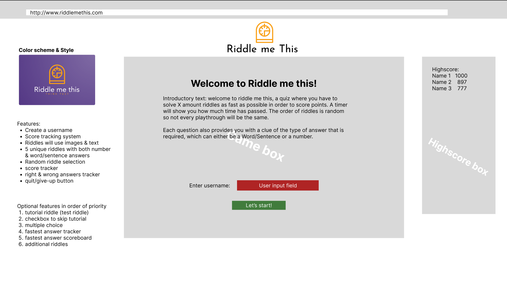

---------------------------------------------------------------------------------------------------------------------
# Riddle me this! Quiz

The Riddle me this quiz is a game challenging the player to answer 5 riddles in a row (as fast as possible) and with as few mistakes as possible. Upon starting the game 5 riddles are selected from a pool of 50 riddles at random, guaranteeing a unique experience every time a player starts a run. Every time somebody finished a run, either by giving up or completing 5 riddles, the score is pushed to a leaderboard. Only the top 10 players are displayed on the leaderboards however, so the pressure is on to perform! The website is geared towards people who enjoy a challenge, focussing on the ability to solve riddles under time pressure. Wrong answers are registered as well, so brute-forcing a solution is not an option!

Do you believe you got what it takes to conquer the leaderboard?
Let's find out!

* the website of <a href="https://wouter-it.github.io/Riddle-me-this/" target="_blank">*Riddle Me This!*</a>.

# Contents
- [User Experience UX](<#user-experience-ux>)
  - [Wireframes](<#wireframes>)
  - [Site Structure](<#site-structure>)
  - [Design & Color Scheme](<#design--color-scheme>)
    - [Typography](<#typography>)
    - [Color Palatte](<#color-palette>)
- [Features](<#features>)
  - [Current Features](<#current-features>)  
    - [Logo](<#logo>)
    - [Introduction & Greetings](<#introduction--greetings>)
    - [User Registration](<#user-registration>)
    - [Leaderboard](<#leaderboard>)
    - [Player Score](<#player-score>)
    - [Riddle Image](<#riddle-image>)
    - [Riddle text and Hint](<#riddle-text-and-hint>)
    - [Answering riddles](<#answering-riddles>)
    - [Timer](<#timer>)
    - [Buttons](<#buttons>)
    - [Images credit](<#images-credit>)
  - [Future Features](<#future-features>)
- [Technologies & Tools used](<#technologies--tools-used>)
- [Testing](<#testing>)
- [Deployment](<#deployment>)
  - [How to deploy the project yourself](<#how-to-deploy-the-project-yourself>)
  - [Copy repo to GitHub](<#to-copy-the-repository-in-github>)
  - [Create local clone](<#to-create-a-local-clone-of-this-project>)
- [Credits](<#credits>)
  - [Content](<#content>)
  - [Media](<#media>)
- [Acknowledgements](<#acknowledgements>)

# User Experience UX

## Wireframes

The Wireframes for Riddle me this were made using [Figma](https://www.figma.com/) as opposed to Balsamiq due to familiarity and experience that has been built up with Figma over the past months. There are wireframes for three separate devices; Full-Screen, Tablet and Mobile.
The final design of the website varies slightly from the Figma wireframes in some regards as during the process it was discovered the design could be altered to reduce complexity.

[Back to top](<#contents>)

## Site Structure

Riddle me this has 1 page with 2 distinct different "screens". The page alters between these screens as the user plays the game and completes, or gives up on runs. The first screen displays a greeting and instructions. It introduces the user to the game and attempts to motivate the user to become a player. This happens when the user fills in a username and presses "Enter" or the "Start" button. On the right-hand-side, there is a leaderboard dislaying the scores of players who have come before, which can include runs they have completed themselves in the past as wel. Upon registering a username the introductions/greetings text and the username input field are hidden from view and the game screen, the second screen of the two, is revealed. This screen displays an image, the riddle text and a hint as to what type of answer we are looking for, for each of the riddles. It also inclused a button for answering, skipping and forfeiting the riddle. On the left-hand-side, the user can see their current username, score and the amount of wrong answers they have given. 

Upon answering a riddle correctly the answer button is disabled and the "next riddle" button pops up that allows the user to refresh the page and start up the next riddle. Upon completing the 5th riddle the user is brought back to the greeting/introduction screen.  

[Back to top](<#contents>)

## Design & Color Scheme

### Typography
The typography that was chosen for this project was <a href="https://fonts.google.com/specimen/Josefin+Sans?query=josefin+sans" target="_blank">Josefin Sans</a> for the headers and <a href="https://fonts.google.com/specimen/Lato?query=lato" target="_blank">Lato</a> with a fall-back on sans-serif as body text. Josefin Sans was chosen because it has a playful style to it which matches the atmosphere the game is going for. It helps to set the correct mood/mindset for the player and helps sell the overall game on the website. Lato was chosen as body and navigation text based on the recommendation from <a href="https://www.figma.com/google-fonts/josefin-sans-font-pairings/#:~:text=Josefin%20Sans%20font%20pairings,One%2C%20Lato%2C%20and%20Playfair." target="_blank">Figma</a> as a suitable match. It also has a clean look that's easy to read and thus suited for explanatory and riddle text.

[Back to top](<#contents>) 

### Color Palette

The color scheme for the website can be described as "striking" and originates from the desire to make the page memorable (both visually as well as a fun game experience), playful, yet also functional. The colours picked aren't too bright to remain easy on the eyes and not draw attention away from the game. The white colour was chosen to break up the color further and to ensure the text is easily readable against the background. Overall the color scheme serves its purpose without sacrificing anything on readability and accessibility. In the end, it was decided to not include Cerulean in the final website.

[Back to top](<#contents>)

# Features

## Current Features

### Logo 
- Located at the very top of every page is the logo and name of the game.  
- Immediately tells the user on what site they are.
- The logo image disappears on smaller devices so as to not take up too much space when limited is available.

[Back to top](<#contents>)

### Introduction & Greetings
- Located just below the Logo is the introduction and greeting text. It explains the game and what is expected of the player. It is closed off with an enticing phrase to motivate the user to start playing.
- The opening sentence is designed to immediately convey the core information of the game, so a user can decide straight away if they want to remain on the page or not.

[Back to top](<#contents>)

### User registration
- A single text input field with a lable clearly stating where to enter your username when you want to participate.
- The CTA is green to clearly stand out from the environment, making it easy to find an drawing the users attention to the bottom of the page.
- Username input field only takes 9 characters as to not cause UX issues when a player picks a very long name.
- The username is not allowed to be empty or just a "space" and must require at least 1 character.
- Is selected immediately upon opening the page so a user can provide a username without having to select the field first.

[Back to top](<#contents>)

### Leaderboard
- A leaderboard clearly states the scores of previous players. Also puts an emphasis on the competitive nature of the game. 
- Contains the top 10 player runs and their score and sorts them based on score from high to low.
- Bumps off the lowest score after a new score has been achieved.
- Currently, the leaderboard is not saved in a database and will reset upon refreshing the browser.

[Back to top](<#contents>)

### Player Score
- Box on the left-hand-side of the screen during gameplay to provide information to the player.
- Invisible on the greeting screen as the information is not required at that time. Becomes visible during play and turns invisible upon completing a run.
- Tracks the Username input from the user, their score which updates after each riddle is completed successfully, and the number of wrong answers provided.
- Wrong answers tick up every time an incorrect input is given. However, the input field has to contain at least a character for it to register as "wrong".

[Back to top](<#contents>)

### Riddle image
- Situated in the middle of the screen, draws in the player's attention.
- A unique image for each riddle that provides visual feedback on the riddle and what it entails.
- Often directly associated with the text of the riddle, however, not tied to the answer of the riddle so as to not provide the player with an obvious clue.
- Increases visual appeal of the game as well as memorable riddles.

[Back to top](<#contents>)

### Riddle text and hint
- Directly below the riddle image is the explanatory text describing the riddle.
- Key element for the game as it explains the riddle the player needs to deduce their answer from.
- A hint tells the player the type of answer that is required to solve the riddle. This reduces complexity and along with the introduction text guide the players to apply a specific style of answers without additional unnecessary text.
- About 25% of the riddles require a number as an answer, the hint will help indicate that by asking for a number. 

[Back to top](<#contents>)

### Answering riddles
- Underneath the text players have the answer field to input their guess for a specific riddle.
- An answer has to contain at least 1 character, otherwise it throws an alert notifying the player of this fact and preventing accidental wrong answers.
- Before checking the answer, the user input it turned into small letters in order to account for potential capitalisation.
- Checks the input of the player with the answer stored in the riddle object, if they match the player scores 500 points. Additional points can be gained from answering a riddle as fast as possible, as explained in the next feature.
- Is selected immediately upon starting the game/proceeding to the next riddle so a player can provide an answer without having to select the field first.
- Provides an alert notifying the player if their answer was correct/incorrect. If incorrect, it clears the input and sets the focus to the input field so the player can start typing again.

[Back to top](<#contents>)

### Timer
- Purposefully right below the answer input field to increase pressure on the player while answering a riddle.
- Counts up from 0 upon starting a new riddle, pauses after answering and resets upon starting the next riddle.
- Provides additional points if answered within a specific time: Within 10 seconds adds 250 points, between 10 to 20 adds 200 points, between 20 and 40 adds 100, between 40 and 90 adds 50 points.
- Besides pressure, it also demotivates cheating behaviour by looking up answers to riddles and rewards being a skilful riddle solver.

[Back to top](<#contents>)

### Buttons
- Four colored buttons to allow the player to navigate the game.
- Distinctly different colors to make them stand out and to inform the player that each button has a different "type" of action attached to it. Green to further proceed in the game (Start, submit, next and end game after the final riddle.) Yellow to skip a riddle. Red to forfeit a run. Grey to indicate a button cannot be interacted with.
- Submit is the first button because it is the desired input from the player (a guess to the riddle). It can be clicked or activated by pressing "Enter" after filling in an answer. Button is disabled upon answering correctly, preventing a player from scoring additional points by repeating the same answer.
- Skip allows a player to skip the riddle if they don't know the answer but do want to proceed with their run. Upon skipping the player receives an alert with the answer, and instructions to click on the next riddle button. The submit button is disabled and the Next riddle button enabled upon clicking skip to prevent scoring points from the answer of the riddle.
- Forfeit allows the user to end their run. Upon clicking it verifies if this was the player's intended action by use of an alert. If the player again confirms they desire to end the run they are brought back to the introduction screen. Their score is pushed to the leaderboard, and all player data is reset so the player can start a new run if they so desire. 

[Back to top](<#contents>)

### Images credit
- At the bottom of the screen, below the buttons.
- Provides a credit to the creator of the images used for the game.
- Contains a link to the page of the creator of the images.

[Back to top](<#contents>)

## Future Features
- Ability to immediately start a new run after forfeiting your current run without having to input a new username.
- Leaderboard database to allow playing vs other people on their own devices.
- Feedback for correct/incorrect answers that do not use the browser alert system.
- Wrong answers count in the leaderboards.
- Hint buttons that provides a clue to the answer of the riddle at the cost of points.

[Back to top](<#contents>)

# Technologies & Tools used
- [HTML5](https://en.wikipedia.org/wiki/HTML5/) - takes care of the structure and backbone of the content & website.
- [CSS3](https://www.educba.com/what-is-css3/) - facilitates the styling of content on the page.
- [JavaScript](https://developer.mozilla.org/en-US/docs/Learn/JavaScript/First_steps/What_is_JavaScript) - is the logic behind the website that facilitates interactive elements and feedback based on user input/actions.
- [Figma](https://www.figma.com/) - used to create sketches/wireframes for the website.
- [Gitpod](https://www.gitpod.io/#get-started) - used to deploy and edit the website.
- [Github](https://github.com/) - used to host website repository.

[Back to top](<#contents>)

# Testing
Please refer to the testing document [**_here_**](TESTING.md) for more information on the testing process for Riddle me This! page.

[Back to top](<#contents>)

# Deployment

### **How to deploy the project yourself**
The website was deployed to GitHub pages. In order to replicate the website in your own environment please follow the steps below:
  1. In the GitHub repository which you can find through [this link](https://github.com/Wouter-IT/Riddle-me-this) navigate to the **Settings** tab.
  
  2. In settings, navigate to the **Pages** tab on the left-hand side in the section "Code and automation".
  3. Under **Source**, set the branch to **main** and then click **save**.
  
  4. Upon selection, the page will automatically refresh. A ribbon display will indicate the deployment has been successful.

[Back to top](<#contents>)

### **To copy the repository in GitHub**
A copy of the repository can be made by forking the GitHub account. You can view and alter this copy without it affecting the original repository. You can fork the repository by;
1. Logging in to your GitHub and locate the [repository](https://github.com/Wouter-IT/Riddle-me-this).
2. On the top right corner of the page is a button called **'Fork'**. Clicking on the button creates a copy of the original repository in your own GitHub Account.

[Back to top](<#contents>)

### **To create a local clone of this project**
You can also create a local copy of the project using the following steps:
1. Open the project repository and make sure you are currently in the **<> Code** tab.
2. On the right, click on the left of the two buttons named **<> Code**. This will open a dropdown menu which displays the URL of the project, copy this URL.

3. In your IDE of choice, open **Git Bash**.
4. Change the current working directory to the location where you would like the cloned directory to be.
5. Type **git clone** and paste the URL copied from GitHub.
6. Press **enter** and the local clone will be created.

[Back to top](<#contents>)

# Credits

## Content
- My Fonts from [Google Fonts](https://fonts.google.com/).
- [Looka](https://looka.com/onboarding/) for Logo & Style inspiration. 
- [Figma](https://www.figma.com/) for finding a maching font to Josefin Sans.
- [Coolors.co](https://coolors.co/) for the color palatte.
- Credits to the [Wawawoods project README by Ewan Colquhoun](https://github.com/EwanColquhoun/wawaswoods) to help create and structure my own README. This was a tremendous help.
- Sections of my own code form the Love Love Maths project that I have repurposed to suit my needs for this website: Incrementing score, Incrementing wrong answers, and Riddle selection.
- [W3Schools](https://www.w3schools.com/howto/howto_js_validation_empty_input.asp) for the code on checking/validating user input.
- [W3Schools Dropshadow](https://www.w3schools.com/css/css3_shadows_box.asp ) for the code to apply a dropshadow to the boxes on screen.
- [JSHint Documentation](https://jshint.com/docs/) for the "falls through" code comments to help JSHint ignore things in the code that it considers to be "sub-optimal" however are constructed in that specific way on purpose.
- [Codingbeautydev](https://codingbeautydev.com/blog/javascript-check-if-string-contains-whitespace/) for the code to check for whitespaces in user input.
- [Stack Overflow](https://stackoverflow.com/questions/10261986/how-to-detect-string-which-contains-only-spaces) for the code to check if a string contains only whitespaces.
- [Bobby Hadz](https://bobbyhadz.com/blog/javascript-clear-input-field-after-submit) for the code to clear an input field upon submitting.
- [Developer Mozxilla Webpage on parsing Integers](https://developer.mozilla.org/en-US/docs/Web/JavaScript/Reference/Global_Objects/parseInt) for check the type of input that is received.
- [Scaler](https://www.scaler.com/topics/javascript-disable-button/) for code to disable a button.
- [Tutorials Teacher](https://www.tutorialsteacher.com/javascript/display-popup-message-in-javascript) for code to display pop-up for confirming a user action.
- [Flaviocopes](https://flaviocopes.com/how-to-sort-array-of-objects-by-property-javascript/) for code to sort the leaderboard based on multiple keys in an array of objects.
- [Linuxhint](https://linuxhint.com/javascript-count-up-timer/) for code for the timer.

[Back to top](<#contents>)

## Media
- [Flaticon & Author Freepik](https://www.flaticon.com/authors/freepik) for all riddle images.

[Back to top](<#contents>)

# Acknowledgements
The Riddle me This quiz page was created as a project for the second milestone of the [Code Institute Full-Stack Development Course](https://codeinstitute.net/nl/full-stack-software-development-diploma/). During the learning process I've received excellent support and guidance from my mentor [Precious Ijege](https://www.linkedin.com/in/precious-ijege-908a00168/) who, dispite my own scheduling issues, has been able to keep me on track, showing nothing but support while being critical of the product, and ensured my project scope was realistic. I'd like to thank him for his guidance.

[Back to top](<#contents>)
