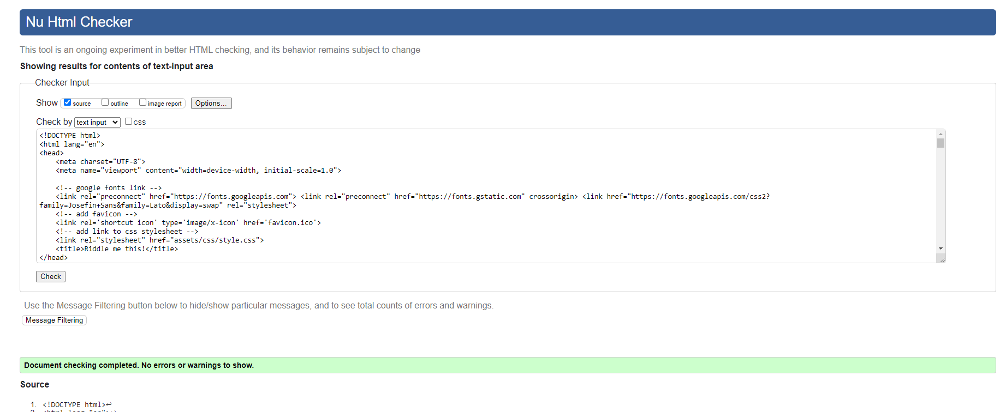
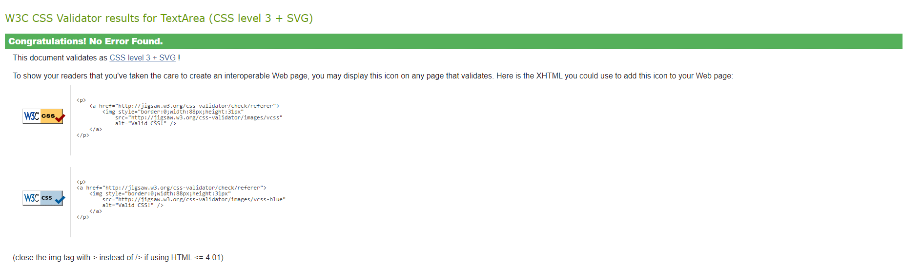
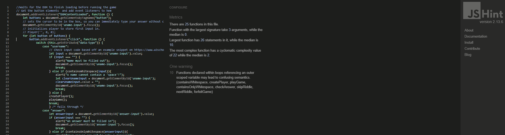
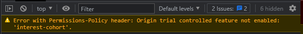
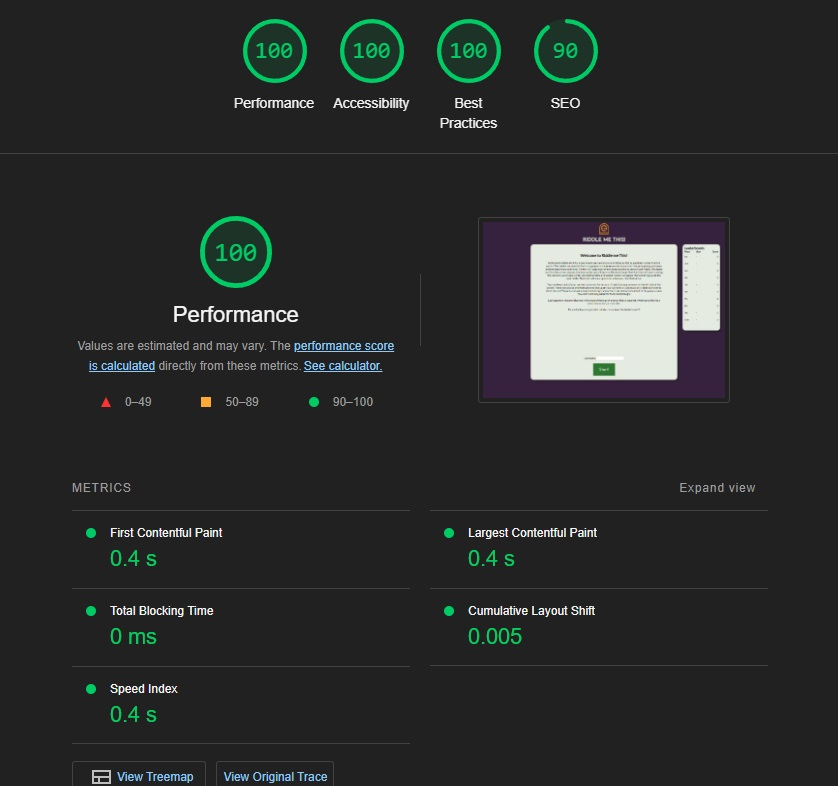

# Testing

## Code Validation
In order to properly test the Riddle me This website it has to be run through the [W3C HTML Validator](https://validator.w3.org/), the [W3C CSS Validator](https://jigsaw.w3.org/css-validator/) and [JSHint](https://jshint.com/) respectively. One errors were encountered during this process.

### HTML

**Home**  

### CSS
**CSS Validation**  

### JSHint
**JSHint Validation**  

The JS Hint error is caused by the use of outer scope variables in functions containing loops. In the current design it is not possible to organise the code in other ways that prevent this error.  Additionaly, as according to [RandellDawson on FreeCodeCamp](https://forum.freecodecamp.org/t/functions-declared-within-loops-referencing-an-outer-scoped-variable-may-lead-to-confusing-semantics/567536) it is mainly a warning and does not mean the code doesn't function, I opted for , after extensive testing, keeping the code as it stands.

### Chrome Console Error

In the deployed version of the site the error below pops up. This is caused by github.io which disabled support for FLoC by default. It does not influence website performance in any way according to [PositionIsEverything](https://www.positioniseverything.net/error-with-permissions-policy-header-unrecognized-feature-interest-cohort./). The error message can be prevented by disabling FLoC in Chrome. 

## Responsiveness

|             | Iphone 5 | Moto G4 | iPhone 6 | iPhone 12 pro | iPad mini | iPad Air | Display <1300px | Display 1920px  | Display 2560px  |
|-------------|----------|---------|----------|---------------|-----------|----------|-----------------|-----------------|-----------------|
| Navigation  | pass     | pass    | pass     | pass          | pass      | pass     | pass            | pass            | pass            |
| Images      | pass     | pass    | pass     | pass          | pass      | pass     | pass            | pass            | pass            |
| Videoplayer | pass     | pass    | pass     | pass          | pass      | pass     | pass            | pass            | pass            |
| Links       | pass     | pass    | pass     | pass          | pass      | pass     | pass            | pass            | pass            |
| Form        | pass     | pass    | pass     | pass          | pass      | pass     | pass            | pass            | pass            |
| Width       | 320px    | 360px   | 375px    | 390px         | 768px     | 820px    | 950 to 1300px   | 1920px          | 2560px          |

During testing on a wide variety of screen sizes it was noted that the website degrades in quality in screens smaller than 320px and wider than 1440p. The website remains usuable and its structural integrity intact, but text becomes hard to read.
Also very thin screens cause issues with elements overlapping, however, this is only the case in unconventional screen sizes or odd scaled webbrowser windows. AN example can be found in the unresolved bug section below.

## Browser Compatibility
The testing process has been repeated over multiple browsers and the results are comparable for each Chrome, Mozilla, Safari, Edge. All features function as intended.

## Known Bugs
### Resolved
During development multiple bugs were encountered and resolved.

- Earlier in design there was a bug that caused the page to freeze on random occasions. It was solved by adding code to log the progressions of code segments to the console, ultimately revealing a code segment in the riddle selection that could cause an infinite loop. The code was adjusted accordingly.

- There was a bug that caused the array that selects numbers for the riddle selection to contain duplicate numbers. It was caused by a code typo that caused the code that was supposed to prevent this to only compare the new number to the 2nd number in the array, as opposed to comparing it to the entire array.

### Unresolved

**Text and element overlapping on thin screens**
On unusually thin screens elements still overlap one another on occasion. This issue has been addressed for every common screen size with additional margin, however, in extreme cases still causes issues in responsiveness if a screen is made very thin. This is caused by using absolute positioning on a page and can in most cases be resolved by adjusting elements based on the viewport window height.

## Lighthouse Testing

During some additional testing using the Lighthouse functionality in the Chrome devtools it was confirmed that the changes to the images on the website, being altered from full PNG's to small webp files, has the desired effect. The website performs well but is somewhat low on performance on the "Maps" page. This is to be expected however because there are multiple images to load as opposed to one or two on the other pages.

- Homepage

[**Go Back to README**](README.md)